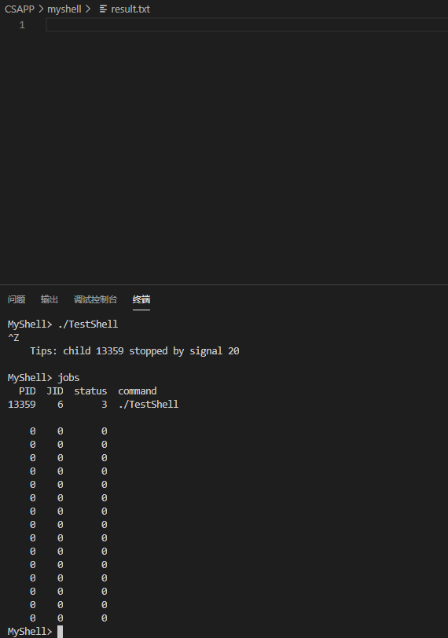
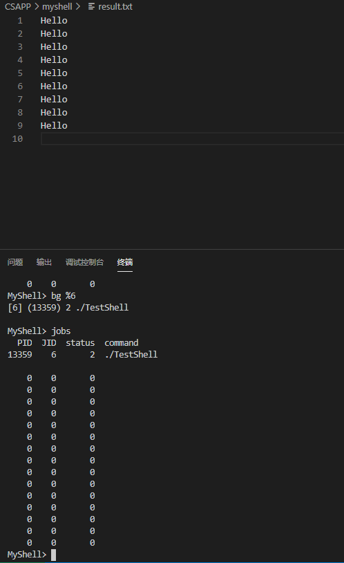
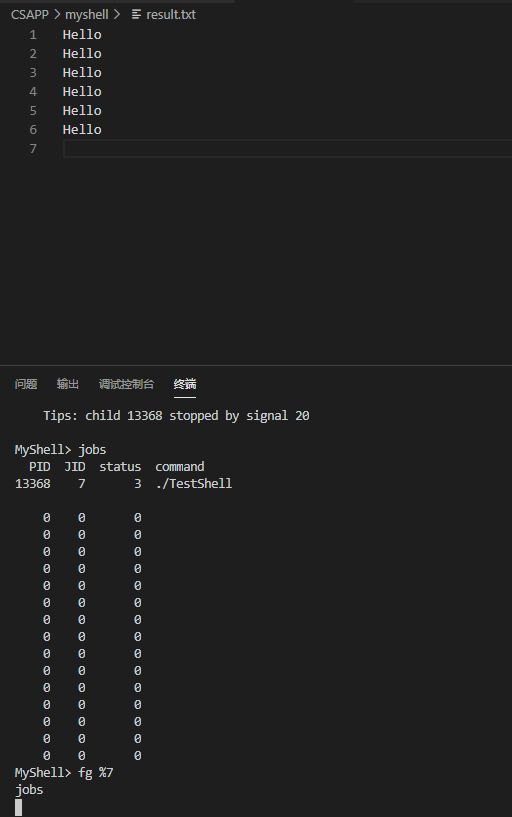

# MyShell操作手册

## 1.背景

MyShell是自行实现的一个Linux shell，具备基本的shell功能

TestShell是用来做验证用的测试程序，源代码在Test Shell.c

实验环境：

0. 本地环境Window10

1. VSCode（工作在本地）
2. C语言
3. 使用VSCode远程连接华为云服务器
4. gcc version 7.4.0 (Ubuntu/Linaro 7.4.0-1ubuntu1~18.04.1) 

## 2.操作步骤

首先编译MyShell和TestShell的源码 正常情况下不会出现任何警告或错误

```makefile
gcc -o MyShell MyShell.c -lpthread
gcc -o TestShell TestShell.c 
```

得到两个可执行程序。

直接运行MyShell即可，会看到如下的提示符，这个时候可以输入指令。这里提醒一下，本程序没有对换行等操作进行处理，所以执行程序的时候，如果不输入指令直接按下回车键会导致程序异常终止。

```shell
MyShell>
```

接下来开始测试

1. 首先测试常见的一些指令

```shell
MyShell> ls -l
total 52
-rwxr-xr-x 1 root root 19376 Nov  2 10:50 MyShell
-rw-r--r-- 1 root root 13881 Nov  2 10:49 MyShell.c
-rw-r--r-- 1 root root     0 Nov  2 10:44 result.txt
-rwxr-xr-x 1 root root  9416 Nov  2 10:38 TestShell
-rw-r--r-- 1 root root   549 Nov  2 10:38 TestShell.c
MyShell> whoami
root
MyShell> touch 123.txt 
MyShell> ls
123.txt  MyShell  MyShell.c  result.txt  TestShell  TestShell.c
MyShell> 
```

2. 然后使用测试程序TestShell进行测试，测试程序的主要目的是为了测试后台运行情况。

   这里提前说明：result.txt原本没有内容，TestShell的功能是每隔两秒钟向result.txt中追加一行"Hello"，在本文的环境下，用VSCode打开result.txt可以看到其变化情况，更方便观察实验效果。

   首先是让其进行后台执行，使用`jobs`内置命令可以看出它在执行 而且状态为`2`即后台执行，等result.txt中出现20行"Hello"后在用`jobs`命令查看，发现这个后台任务已经结束并已经从任务列表中删除

```shell
MyShell> ./TestShell &
[5] (13354) 2 ./TestShell &

MyShell> jobs
  PID  JID  status  command
13354    5       2  ./TestShell &

    0    0       0  
    0    0       0  
    0    0       0  
    0    0       0  
    0    0       0  
    0    0       0  
    0    0       0  
    0    0       0  
    0    0       0  
    0    0       0  
    0    0       0  
    0    0       0  
    0    0       0  
    0    0       0  
    0    0       0  
MyShell> jobs
MyShell>   PID  JID  status  command
    0    0       0  
    0    0       0  
    0    0       0  
    0    0       0  
    0    0       0  
    0    0       0  
    0    0       0  
    0    0       0  
    0    0       0  
    0    0       0  
    0    0       0  
    0    0       0  
    0    0       0  
    0    0       0  
    0    0       0  
    0    0       0  
MyShell> 
```

3. 接下来测试信号(Ctrl z)，为了方便起见，先将result.txt中的内容清空。开始执行TestShell的瞬间按下Ctrl z，该任务就会被挂起到后台，状态为`3` 即stopped，并且此时的result.txt没有任何变化（如果按下Ctrl z足够及时那么result.txt应该为空）

```shell
MyShell> ./TestShell 
^Z
    Tips: child 13359 stopped by signal 20

MyShell> jobs
  PID  JID  status  command
13359    6       3  ./TestShell 

    0    0       0  
    0    0       0  
    0    0       0  
    0    0       0  
    0    0       0  
    0    0       0  
    0    0       0  
    0    0       0  
    0    0       0  
    0    0       0  
    0    0       0  
    0    0       0  
    0    0       0  
    0    0       0  
    0    0       0  
MyShell> 
```



4. 测试`bg`指令，这个指令是将后台挂起进程继续后台执行，可以看到程序已经开始后台执行，而且状态也发生了改变。待TestShell执行完成，再次查看jobs，发现该任务已经被清理

```shell
MyShell> bg %6
[6] (13359) 2 ./TestShell 

MyShell> jobs
  PID  JID  status  command
13359    6       2  ./TestShell 

    0    0       0  
    0    0       0  
    0    0       0  
    0    0       0  
    0    0       0  
    0    0       0  
    0    0       0  
    0    0       0  
    0    0       0  
    0    0       0  
    0    0       0  
    0    0       0  
    0    0       0  
    0    0       0  
    0    0       0  
MyShell> jobs
MyShell>   PID  JID  status  command
    0    0       0  
    0    0       0  
    0    0       0  
    0    0       0  
    0    0       0  
    0    0       0  
    0    0       0  
    0    0       0  
    0    0       0  
    0    0       0  
    0    0       0  
    0    0       0  
    0    0       0  
    0    0       0  
    0    0       0  
    0    0       0  
MyShell> 
```



5. 测试`fg`指令，首先还是先清空result.txt，然后重新执行第三步操作，可以发现任务再次被挂起。`fg`指令是让后台挂起任务放到前台执行，由于shell只允许最多一个前台任务，所以这个时候其他的指令都不能被执行。（最后一行的`jobs`命令不会被立刻执行，但是当TestShell执行完成后就会执行）

```shell
MyShell> ./TestShell
^Z
    Tips: child 13368 stopped by signal 20

MyShell> jobs
  PID  JID  status  command
13368    7       3  ./TestShell

    0    0       0  
    0    0       0  
    0    0       0  
    0    0       0  
    0    0       0  
    0    0       0  
    0    0       0  
    0    0       0  
    0    0       0  
    0    0       0  
    0    0       0  
    0    0       0  
    0    0       0  
    0    0       0  
    0    0       0  
MyShell> fg %7
jobs
```



6. 最后测试`quit`命令，在上一步已经执行完的基础上执行，程序正常退出

```shell
MyShell> quit
root@-------:~/Code/CSAPP/myshell# 
```

## 3.结语

自我反思一下，整个MyShell.c源码有500行左右，明明只是信号控制一下能解决的问题，偏偏花了我好几天的时间，基本功还是不行。~~但是，从此之后我不再称自己是“菜鸡”，要不然每天晚上敲代码的时候一想到“菜鸡”就饿的不行。~~

最后，程序只是简单的测试了一下常规的操作，还有一些问题没有解决，但是整体目标已经达到了，后面还有很多东西要学，不能长时间耽误在这个地方，所以就先这样吧，以后有时间了再折腾。

​                                                                                                                                                --by Panda